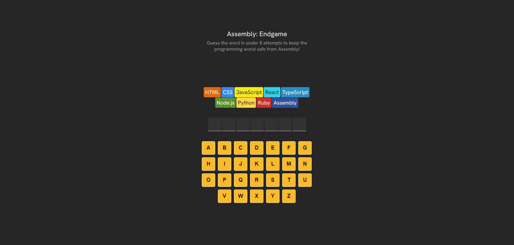
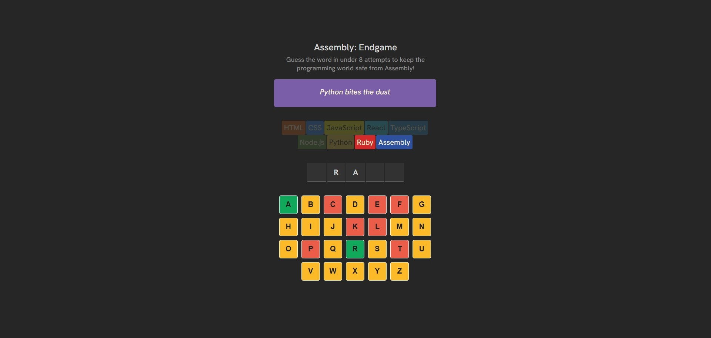
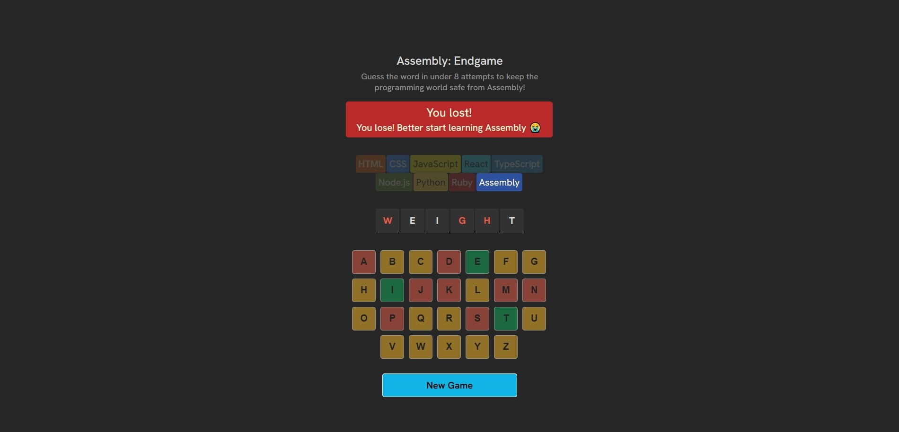
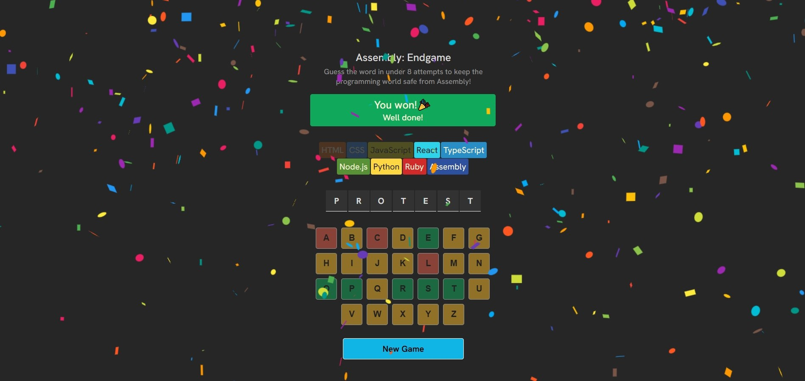

# The Language Survival Game  

## About the App  
This is a small interactive **web app** built with **React** and bundled with **Vite**.  
It’s a silly twist on the classic **Hangman game**, but instead of saving a stick figure, you’re fighting to keep **high-level programming languages** alive so you’re not left in a world with only Assembly language.
You start with a squad of languages (JavaScript, Python, CSS, etc.) and have **8 attempts** to guess before losing them all and therefore losing the game.  
Whenever you lose a language, you’ll get a cheeky message like:  

> *"Gone but not forgotten, CSS."*  

The messages are randomized each time, so you’ll never know exactly how your fallen comrade will be memorialized.  

When all hope is lost and only **Assembly** remains then it is:  
**Game Over.**  and you get a message 

> *"You lose! Better start learning Assembly 😭"*'

---

## Tech Stack  
- **React**   
- **Vite** 
- **JavaScript (ES6+)** 
- **CSS**  

---

## Screenshots

### Starting Screen  
  

### Losing a Language  
  

### Game Over  
  

### Game Over  
  

---

## Getting Started  
```bash
# clone the repository
git clone https://github.com/dkrnjic1/assembly-endgame-app

# move into the project folder
cd project-folder

# install dependencies
npm install

# run the app
npm run dev

